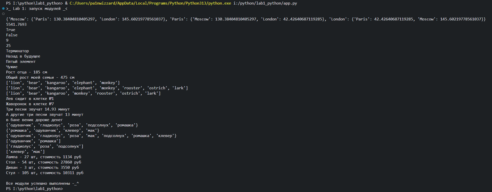

# Лабораторная работа №1

Проект с верхнеуровневым модулем и тестами pytest.

## Задание

- Создайте репозиторий для дисциплины на GitHub или GitLab
- Склонируйте его себе на ПК
- Скачайте архив и распакуйте его в свой репозиторий. В нём 11 заданий, которые вам нужно   выполнить
- Напишите отчёт в README.md. Отчёт должен содержать:
Задание
Описание проделанной работы
Шпаргалку по работе с командами git
Скриншоты результатов
Ссылки на используемые материалы
- Сделайте commit и push
- Напишите верхнеуровневый модуль, который будет использовать логику из модулей-заданий. Перед этим нужно будет придумать способ инкапсулировать логику для корректного импортирования.
- Покройте реализованную фукциональность тестами с использованием pytest.

## Описание проделанной работы

1. Инициализировано новое виртуальное окружение и создан пакет `Lab_1`.
2. Внутри пакета реализованы требуемые функции (см. файлы модуля).
3. Отчет оформлен в этом файле `README.md`.

## Шпаргалка по работе с командами git

```bash
# Инициализация репозитория
git init

git add <файл>           # добавить файл в индекс

# Коммиты
git commit -m "Сообщение"   # создать коммит

# Просмотр статуса
git status

git log                  # история коммитов

# Работа с ветками
git branch               # список веток

# Обновление из удалённого репозитория
git pull

# Отмена изменений
git checkout -- <файл>  # сброс изменений в рабочем каталоге

# Создание новой ветки
git checkout -b <имя-ветки>
```

### Демонстрация работы модулей


## Ссылки на используемые материалы
1. [Официальная документация Python](https://docs.python.org/3/)
2. [Руководство по pytest](https://pytest.org/)
3. [Статьи и руководства по git](https://git-scm.com/doc)
